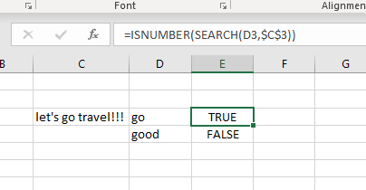
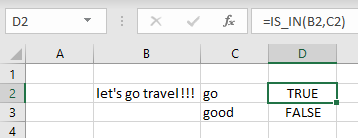
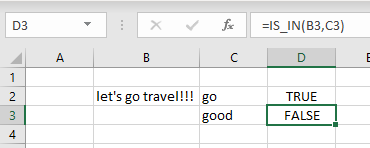

# UDF IS_IN

## 問題点
一つ長いのテキストの中に探したいテキストが含めているか？

例えば："Let's go travel!!!"の中に"go"が含めているか？

"go"の時TRUEで返事、"good"の時FALSEで返事

## 既存解決策


## UDFで行こう
VBAのInStrで探したいのテキストは目標テキストにあるかうを判別する。

### Example code
```vb
Function IS_IN(target_text As String, text_to_search As String) As Boolean
' return True when target text is contain the text
If InStr(target_text, text_to_search) = 0 Then
    IS_IN = False
Else
    IS_IN = True
End If
End Function
```

## 結果





