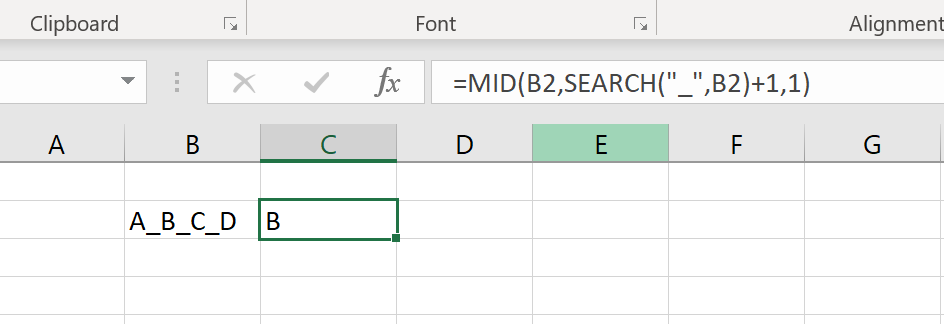

# Excel User Define Function

## 問題
エクセルに"A_B_C_D"がある時、"B"だけを抽出したい。

## インタネットの仕方


- SEARCHというfunctionで分割ものを探す。
- MIDといfunctionで、該当のものを抽出する。

複雑点："B"ならばいいですが、"C"あるいは"D"を抽出したい時、とても複雑になる。

## 解決策
Excel User Defined Functionを作って、Excel Add-Inで自分が作成した関数を使う。

### 1. Excel Developer modeを開いて、新しいmoduleファイルを作成。
1. "Alt"+"f11"を押したら、以下の画面を出るはず。
2. "ThisWorkbook"を右クリックして、"Insert"を指して、"Module"をクリックする。


### 2. 関数の作成
1. "Module"を押したら、一つWindowsが以下のように出るはず。
2. 以下の"Example code"をwindowsの中に入力する。


#### Example code
```vb
Function SPLIT_THE_TEXT(target_text As String, delimiter As String, index As Integer) As String
' return the splited and selected text
SPLIT_THE_TEXT = Split(target_text, delimiter)(index)
End Function
```

### 3.XLAMファイルの保存
1. codeを入力したら、"Alt"+"F11"を押して、普通のエクセルUIの戻る。
2. File→Save As→Browse→save as type "Excel Add-In, *.xlam"
3. この時は多分パソコンが自動的に該当なpathを選択したはず。自動に出たPathにsaveする。


### 4.Excel add inの導入
1. さっきのexcel workbookを閉じて、新しいのを開く。(saveしなくてもいいです。)
2. File→Optionを押すと以下のwindowsが出るはず。


3. "Excel Add-Ins"を確認して、"Go..."を押すと以下の画面が出るはず。


4. さっき作った"My_Excel_Add_In"をチェックして、"OK"ボタンを押す。

### 5. User define function完成
#### 結果展示


#### Errorが出た時

