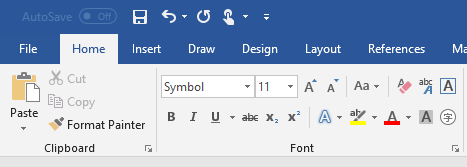
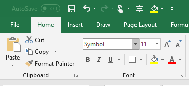
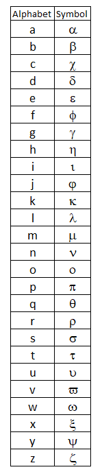

# 特別シンボル

## 問題
試験報告書を書く時にいつも特別シンボルを使う、しかしMS wordとMS Excelの「insert」→「symbol」で一つずつ探すのはめんどくさい。

## 解決策
MS Word and MS Excelの既存フォントに一つ特別なフォントがあって、「Symbol」と呼ばれる。このフォントの機能は普通なabcを特別シンボルに変更する。




### MS Word ショットカット
Excelがこのショットカット機能がない。
```
「Ctrl」+「Shift」+「Q」
```

### アルファベット vs 特別シンボル

